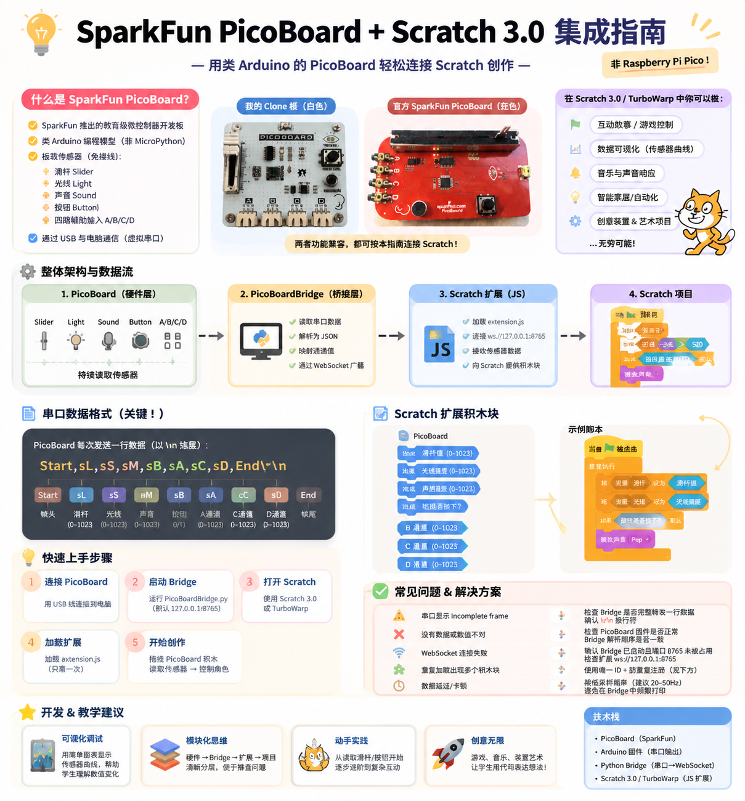

# PicoBoard + Scratch 3.0 Integration

完整的 SparkFun PicoBoard 与 Scratch 3.0 / TurboWarp 集成示例，包括：

- Python WebSocket 桥接程序（串口读取 + 实时推送）
- TurboWarp 本地扩展（extension.js）
- 传感器通道映射与按键防抖调试方案
- 示例工程和分析脚本



## 仓库结构

- PicoBoardBridge.py: Python 串口到 WebSocket 的桥接主程序
- extension.js: TurboWarp 扩展脚本（本地加载）
- docs/debug_process.md: 按键调试过程与参数说明
- examples/example_project.sb3: 示例 Scratch/TurboWarp 项目
- examples/example_scripts/: 日志分析与防抖仿真脚本

## 1 分钟快速上手（Windows）

下面是给新手的推荐流程，直接复制执行即可。

### 1. 准备环境

- 安装 Python 3.10 或更高版本
- 打开 PowerShell，进入仓库目录

### 2. 创建并激活 venv

```powershell
py -3.10 -m venv .venv
.\.venv\Scripts\Activate.ps1
python -m pip install --upgrade pip
pip install -r requirements.txt
```

如果激活时报执行策略错误，可先临时放开当前会话：

```powershell
Set-ExecutionPolicy -Scope Process -ExecutionPolicy Bypass
```

### 3. 连接 PicoBoard 并启动桥接程序

先扫描当前电脑可用串口：

```powershell
python PicoBoardBridge.py --list-ports
```

```powershell
python PicoBoardBridge.py --serial-port COM14 --serial-log
```

默认配置：

- WebSocket 地址：ws://127.0.0.1:8765
- 串口：COM14（可通过 --serial-port 覆盖）
- 波特率：38400（默认值；仅在非默认速率时再用 --baudrate 覆盖）

如果你的串口不是 COM14，不需要改源码，直接改命令行参数：

```powershell
python PicoBoardBridge.py --serial-port COM5
```

### 4. 在 TurboWarp 加载扩展

1. 打开 TurboWarp Desktop 或在线版。
2. 选择加载本地扩展文件。
3. 选择本仓库中的 extension.js。
4. 看到 PicoBoard 积木（Slider/Light/Sound/Button/A/B/C/D）后，开始测试。

## Python venv 使用说明

后续每次开发前建议按下面流程：

```powershell
# 进入仓库
cd <your-repo-path>

# 激活虚拟环境
.\.venv\Scripts\Activate.ps1

# 运行程序
python PicoBoardBridge.py --serial-port COM5

# 退出虚拟环境
deactivate
```

为什么要用 venv：

- 不污染全局 Python 环境
- 每个项目依赖隔离，复现更稳定
- 新人切换项目不容易“包冲突”

## 调试与分析

### 采集日志

```powershell
python PicoBoardBridge.py --serial-log --serial-log-file
```

日志会保存到 logs/serial_YYYYMMDD_HHMMSS.jsonl。

### 离线分析脚本

```powershell
python examples/example_scripts/analyze_log.py logs/<your-log>.jsonl
python examples/example_scripts/scan_candidates.py logs/<your-log>.jsonl --expected 8
python examples/example_scripts/simulate_debounce.py logs/<your-log>.jsonl
```

更多背景请看 docs/debug_process.md。

## 常见问题

### 1. TurboWarp 里没有数据变化

- 先确认 Python 程序已运行且没有串口报错
- 再确认 extension.js 已成功加载
- 检查串口是否被其他软件占用

### 2. 串口打开失败

- 在设备管理器确认 COM 口号
- 可先运行 python PicoBoardBridge.py --list-ports 查看可用串口
- 通过 --serial-port 指定实际端口，例如 COM5
- 如设备要求不同速率（非默认 38400），再配合 --baudrate

### 3. 安装依赖失败

- 先执行 python -m pip install --upgrade pip
- 确认当前已激活 .venv

## 许可证

本项目使用 LICENSE 中声明的许可证。

